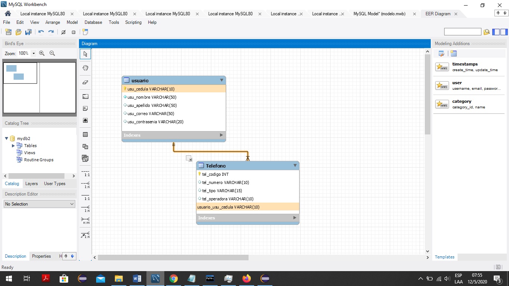
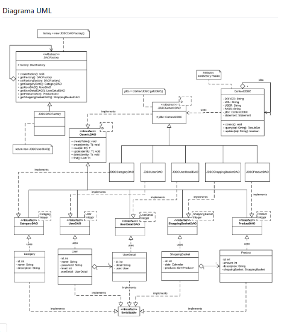
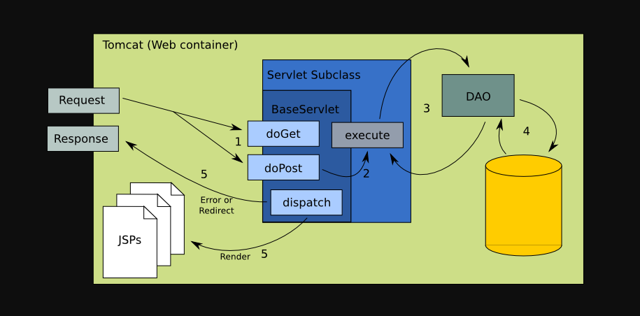
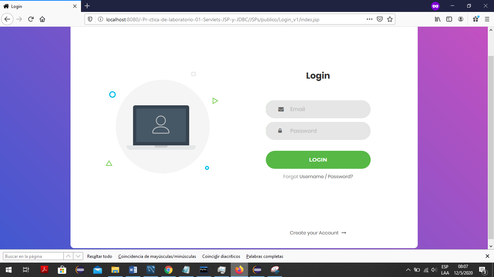
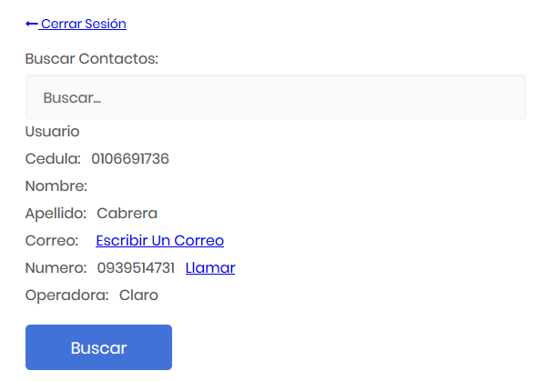
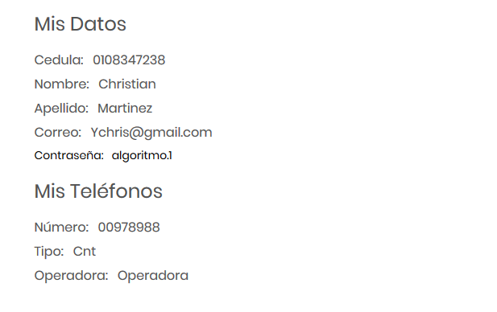
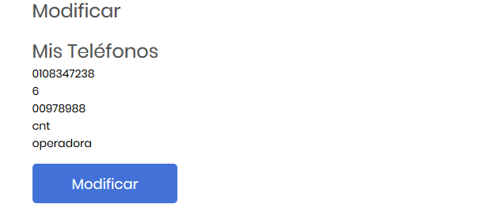
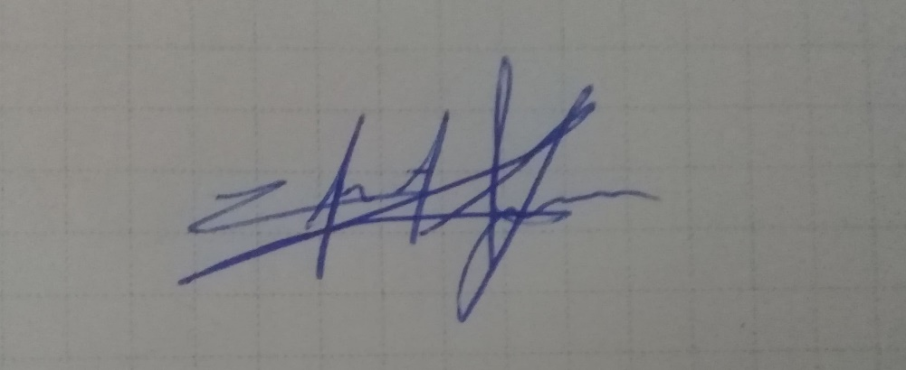

**1.Se siguió el siguiente diagrama relación para el desarrollo de la práctica**

**2. Se usó el patrón DAO para el desarrollo de la práctica se basó en el
siquiente modelo**

**2. Se usó el patrón DAO para el desarrollo de la práctica se basó en el
siquiente modelo**

**4. Esta fue la arquitectura final que se uso para el desarrollo de la
practica**

**Se puede observar que es un modelo vista controlador con patrón de diseño
DAO**

**RESULTADO(S) OBTENIDO(S)**:

**CONCLUSIONES**: la practica nos sirvió para entender de mejor manera como el
patrón DAO nos puede ayudar para hacer todo lo que necesitemos en nuestra base
de datos, también se pudo conocer a mayor profundidad como es que trabaja el
modelo MVC aplicado en web apps.

**RECOMENDACIONES**: tener apagado el tomcat cuando se lo requiere pues es un
poco impredecible, a la hora de llamar datos desde la base de datos tener en
cuenta que no deben haber registros con campos nulos pues provoca que se
entorperzca el seteo de datos.

**Nombre de estudiante: Christian Yunga**

*Firma de estudiante*

